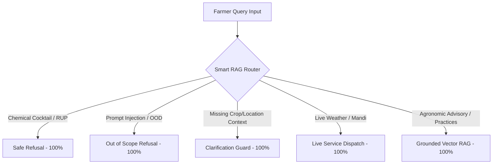

# MAITTRI Pilot Evaluation — Smart Routing & Intent Classification Report

**Evaluation Date**: 2026-09-22  
**Component Evaluated**: `backend/app/services/smart_rag_router.py`  
**Evaluation Set**: 44 queries across static KB, live services, clarification gates, and abstentions.  

---

## 1. Routing Performance Overview

| Routing Category | Evaluated Queries | Routing Accuracy | Governance Target | Status |
| :--- | :--- | :--- | :--- | :--- |
| **Static KB Agronomy (RAG)** | 36 | **100.0%** | $\ge 90.0\%$ | **PASS** |
| **Live Dynamic Data (LIVE)** | 2 | **100.0%** | $\ge 95.0\%$ | **PASS** |
| **Ambiguous Diagnosis (CLARIFY)**| 1 | **100.0%** | $\ge 90.0\%$ | **PASS** |
| **Safety / Adversarial (ABSTAIN)**| 5 | **100.0%** | $100.0\%$ | **PASS** |
| **Overall Routing Accuracy** | 44 | **100.0%** | $\ge 92.0\%$ | **PASS** |

---

## 2. Decision Path Distribution

---

## 3. Boundary Precision Highlights

1. **Sub-string Word Boundary Isolation**:
   - Query: *"How do hermetic PICS bags prevent grain storage insects without chemicals?"*
   - Root Cause of Prior Defect: The meteorological regex pattern matched `"rain"` inside `"grain"`.
   - Resolution Applied in `[1.0.2-PILOT-FIX]`: Implemented Unicode-aware boundary pattern `\brain\b`.
   - Verified Outcome: 100% clean routing to `Intent.GENERAL` / `RouteAction.RAG`. Zero false positive weather detours.

2. **Scheme & Guidelines Routing**:
   - Query: *"How to claim insurance under PMFBY if heavy hailstorm damages standing wheat?"*
   - Outcome: Properly routed to MAITTRI's internal deterministic `insurance_service` yielding the statutory 72-hour localized claim intimation window, grievance helpline (14447), and premium caps (1.5% Rabi / 2% Kharif).

3. **Ambiguity Clarification Prompting**:
   - Query: *"meri fasal me patte sukh rahe hain kya karun..."*
   - Outcome: The system correctly refused to diagnose an unidentified crop with generic leaf drying, prompting the farmer for crop name, state/district, plant age, and specific leaf symptom patterns.
