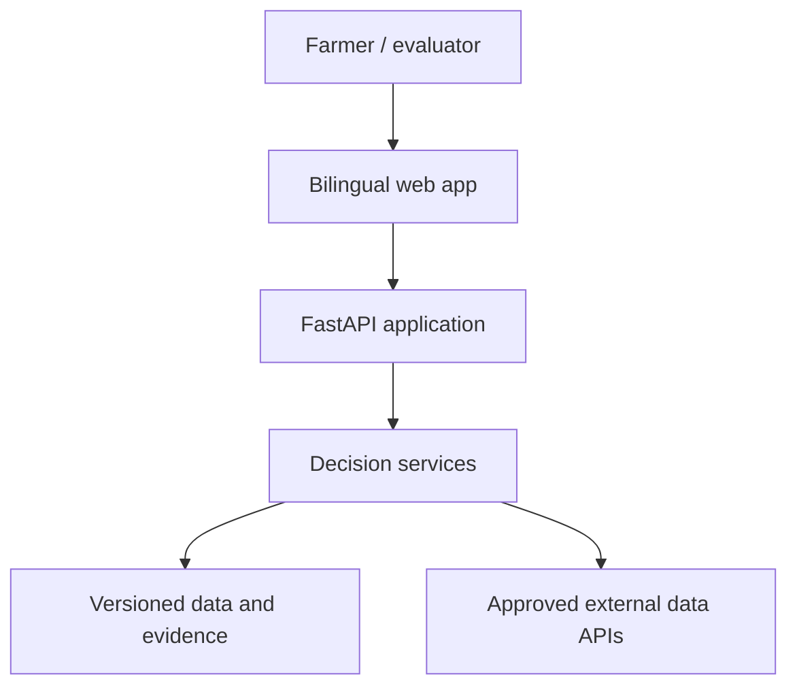
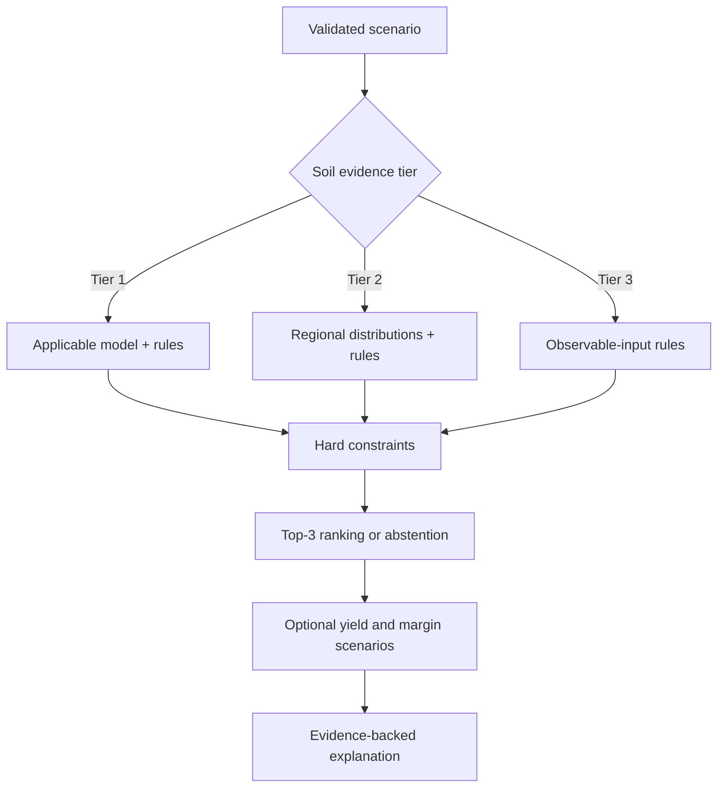
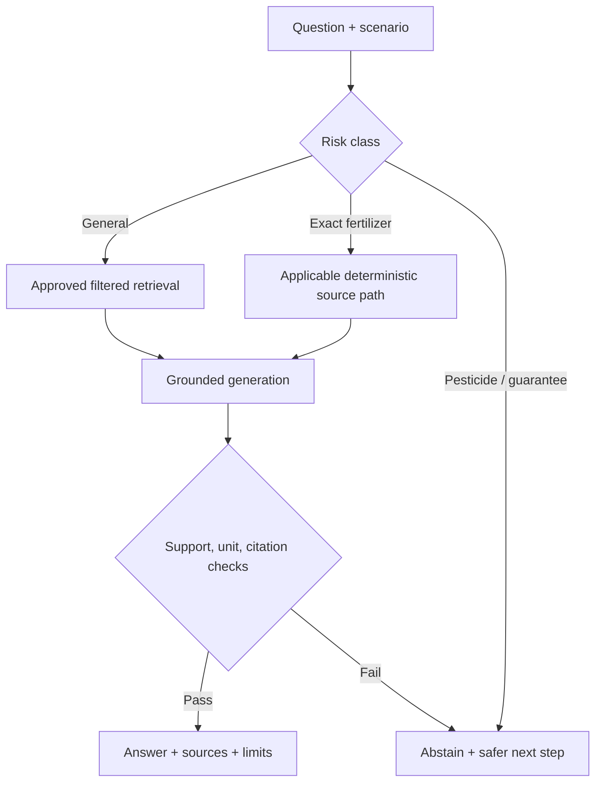
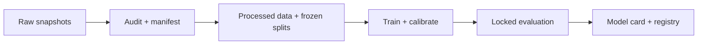

# System Architecture

## 1. Architecture goal

The architecture separates deterministic safety/agronomic logic, statistical prediction, economic simulation, and LLM explanation so that each can be evaluated, versioned, disabled, and audited independently. The LLM is never the authority for crop eligibility, exact high-risk dosage, yield computation, or gross-margin calculation.

## 2. Context



## 3. Logical components

| Component | Responsibility | Must not do |
|---|---|---|
| Web app | Collect tier-aware inputs; show Top-3, uncertainty, evidence, citations, and abstention | Invent defaults or hide missing evidence |
| API boundary | Validate schemas/units, authenticate admin routes, rate-limit, assign request/audit IDs | Contain research logic in controllers |
| Scenario service | Normalize known inputs and preserve unknown/estimated status | Convert estimates into measured fields |
| Risk router | Classify request type and select allowed mechanism | Let prompts override safety policy |
| Rule engine | Apply versioned hard constraints and approved deterministic guidance | Use unreviewed rules |
| Recommendation service | Run eligible baselines/hybrid scoring and Top-3 selection | Treat probability as success/profit probability |
| Yield service | Produce district-season point/range only when applicability passes | Claim field-specific yield |
| Economics service | Run reproducible Monte Carlo gross-margin scenarios | Promise profit or hide assumptions |
| Retrieval service | Filter approved sources, retrieve chunks, preserve metadata | Retrieve disabled/stale/inapplicable sources |
| Generation service | Explain retrieved evidence in English/Hindi | Generate high-risk facts absent from evidence |
| Citation/answer guard | Check support, required citations, numbers/units, and abstention conditions | Treat citation presence alone as support |
| Audit service | Store versions, routes, evidence IDs, outputs, and errors with PII minimization | Store secrets or unnecessary raw personal data |
| Training/evaluation pipelines | Reproduce features, models, calibration, metrics, and figures | Train inside request-serving code |

## 4. Recommendation flow



Key invariant: Tier 3 never calls a model whose required inputs include exact laboratory N/P/K/pH. Tier 2 propagates a distribution or uncertainty state and labels the values as regional estimates.

## 5. RAG and safety flow



The risk class, selected pathway, retrieved chunk IDs, source versions, guard results, and abstention reason are part of the audit record.

## 6. Data plane and control plane

### Data plane

- PostgreSQL for scenarios, normalized agricultural observations, rules, source metadata, model/corpus versions, and audits.
- `pgvector` in the same database for MVP embeddings, combined with full-text/keyword retrieval.
- Immutable raw data and large artifacts in versioned object/file storage outside the relational database.
- Local or managed cache for external API responses; every cached value retains source and timestamp.

### Control plane

- Admin approval/status for sources, rules, corpus documents, and model versions.
- Model registry entry with intended use, metrics, applicable scope, and failure modes.
- Configuration-driven thresholds, scoring weights, freshness windows, and provider selection.
- Kill switch/feature flag for yield, economics, or RAG routes that fail validation.

## 7. Storage model

Minimum entities:

| Entity | Key fields |
|---|---|
| `scenario` | ID, created time, language, district, season, land, irrigation, previous crop, soil tier, input provenance |
| `soil_observation` | scenario ID, variable, value/range/distribution, unit, measured/estimated/observed, method, source/date |
| `source_document` | ID, authority, title, URL, version/date, checksum, language, applicability, status |
| `agronomic_rule` | ID/version, risk, applicability, condition/equation, source ID, reviewer status |
| `data_snapshot` | manifest ID, source, checksum, spatial/temporal coverage, status |
| `model_version` | ID, feature contract, data/split/config IDs, metrics, scope, status |
| `recommendation_run` | scenario ID, model/rule versions, eligible set, ranks, scores, abstention, audit timestamp |
| `yield_result` | run ID, geographic level, estimate, interval, coverage target, reliability, model version |
| `margin_result` | run ID, market/sale window, assumptions, P10/P50/P90, loss probability, simulation config |
| `rag_interaction` | risk route, query hash/redacted query, chunk IDs/scores, answer, citations, guard result, abstention |

Historical records reference immutable versions. Updating a source/rule/model never changes what an earlier recommendation used.

## 8. API boundaries

Suggested versioned endpoints:

```text
GET  /api/v1/scope
POST /api/v1/scenarios/validate
POST /api/v1/recommendations
POST /api/v1/recommendations/{run_id}/questions
GET  /api/v1/recommendations/{run_id}
GET  /api/v1/sources/{source_id}
GET  /api/v1/health

POST /api/v1/admin/sources
POST /api/v1/admin/rules
POST /api/v1/admin/models/{model_id}/status
GET  /api/v1/admin/audits/{request_id}
```

All inputs and outputs use typed schemas. Numeric fields require explicit units or a single documented canonical unit. Errors distinguish invalid input, unsupported scope, insufficient evidence, unavailable external data, and internal failure.

## 9. Offline research pipeline



Only an approved registry version may serve user requests. The application does not retrain automatically from new API data.

## 10. External dependency behavior

- External providers are accessed through adapters so they can be replaced without changing decision logic.
- Responses are validated against schemas and plausible ranges.
- Cache keys include location, time window, parameters, source, and provider version when available.
- Freshness requirements are configured by data type.
- On provider failure, show a timestamped cached result only if policy permits; otherwise abstain from the affected module.
- LLM/embedding providers receive the minimum required context and no financial inputs or precise coordinates by default.

## 11. Security boundaries

- Anonymous farmer scenarios are the MVP default; admin functions require authentication and role checks.
- Secrets remain in environment/managed secret storage and are never returned to the browser.
- All external and database traffic uses encrypted transport in deployment.
- Validate file types, sizes, text extraction, and content before corpus ingestion.
- Treat retrieved text as untrusted data; it cannot change system policy or tool permissions.
- Apply per-route rate limits and request-size limits.
- Redact personal data and provider credentials from logs/traces.
- Backups, retention, restore tests, incident logging, and dependency scanning are required before public deployment.

## 12. Deployment stages

1. **Local research:** Docker Compose or local processes; fixture data; no real farmer personal data.
2. **Internal demo:** containerized API, static web app, managed PostgreSQL, restricted admin access, approved data snapshots.
3. **Evaluation pilot:** only after ethics/privacy approval where needed; monitored, scoped users, immutable evaluation configuration.
4. **Public pilot:** outside the final-year MVP unless safety, privacy, operations, and agronomic governance are independently approved.

## 13. Production Authoritative Architecture & Legacy Retirement (Phase 6)

### 13.1 Authoritative Production Infrastructure
As of Phase 6 cutover, **Supabase PostgreSQL and pgvector** serve as the sole authoritative production data layer for MAITTRI:
- **Authoritative Database:** Supabase PostgreSQL (`aws-0-ap-south-1.pooler.supabase.com:5432`).
- **Semantic RAG Engine:** Supabase `pgvector` invoking `private.match_knowledge_chunks` (384-dimensional `all-MiniLM-L6-v2` dense embeddings, HNSW index, cosine distance, isolated in `private` schema with `SET search_path = ''`).
- **Identity & Auth:** Supabase GoTrue Auth (`auth.users`) synchronized 1-to-1 with `public.profiles` using cryptographic UUID identifiers. Argon2id password hashes are preserved.
- **Document Vault:** Supabase Storage private bucket `farmer-vault` enforcing user path isolation (`{user_id}/{filename}`).
- **Chatbot Context:** Zero permanent storage of chatbot queries, responses, or chain-of-thought in PostgreSQL (0 `chat_sessions`, 0 `chat_messages` tables). State remains strictly client/browser-bounded.
- **Production Guard:** Zero silent fallback to SQLite or ChromaDB in production (`ENVIRONMENT=production`). Database failure yields explicit HTTP 503/500 errors.

### 13.2 Legacy Retirement & Archive Locations
Legacy data stores have been retired from active application execution and moved into immutable archive locations:
- **Live SQLite Archive:** `backups/archived_legacy_sqlite/agri.db` (SHA-256: `41ad617ce3cd5fcb39367c07961352a6305334b781d938941badab8cd8978b19`)
- **Root Legacy SQLite Archive:** `backups/archived_legacy_sqlite/root_agri.db` (SHA-256: `3e4b36fa3976c704151044b6a7c1ca6cb9a2037f69f4410025f5acebeeea2127`)
- **Live ChromaDB Archive:** `backups/archived_legacy_chroma/vector_store/`
- **Pristine Migration Backup (Permanently Untouched & Preserved):**
  - `backups/pre_migration_backup/agri.db` (SHA-256: `dd2b616106ae3ce57d6185331621bade39beadd8910a3a9b31e0b52c6985dd2c`)
  - `backups/pre_migration_backup/vector_store/`


